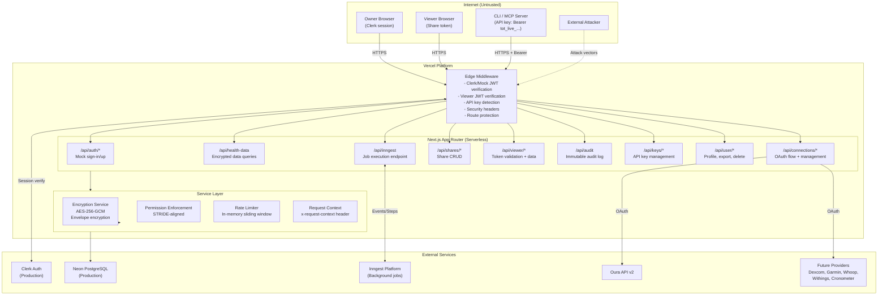
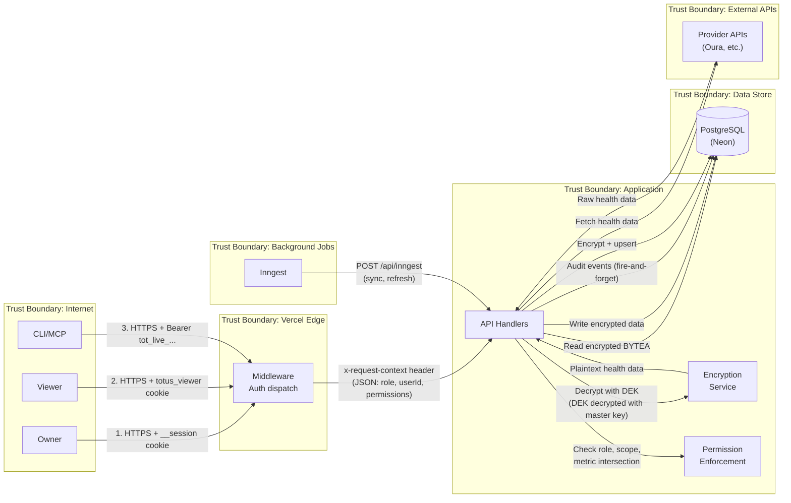

# Threat Model: Totus Health Data Vault
## Version: 1.0 | Date: 2026-03-23 | Status: Initial

---

## 1. What are we working on?

### Description & Scope

Totus is a personal health data vault that unifies health data from wearable devices and health providers (Oura, Dexcom, Garmin, Whoop, Withings, Cronometer, Nutrisense) into a single, encrypted, user-controlled repository. Users can view their health data on a dashboard, share time-limited subsets with doctors/coaches via revocable links, and access data programmatically via API keys (CLI, MCP Server).

**In Scope:**
- Next.js 15 web application (App Router) deployed on Vercel
- Authentication layer (Clerk production, mock JWT dev)
- API routes: health data, connections, shares, audit, keys, viewer, user management
- Envelope encryption system (AES-256-GCM, per-user DEKs)
- OAuth integration pipeline (Oura + future providers)
- Background job system (Inngest: sync, token refresh, partition management)
- Share/viewer system (token-based, anonymous access)
- API key system for CLI/MCP programmatic access
- PostgreSQL database (Neon in production)

**Out of Scope:**
- Vercel platform infrastructure security (shared responsibility)
- Clerk's internal authentication security
- Provider API security (Oura, Dexcom, etc.)
- Mobile applications (none exist)
- DNS/CDN configuration

### Data Classification

| Classification | Data Types | Sensitivity |
|---|---|---|
| **CRITICAL** | OAuth access/refresh tokens, encryption master key (ENCRYPTION_KEY), JWT signing secrets (MOCK_AUTH_SECRET, VIEWER_JWT_SECRET) | Compromise leads to full data breach |
| **HIGH / PHI** | Health metrics (sleep, HRV, heart rate, glucose, body composition, nutrition), raw API responses from providers | Protected Health Information under HIPAA; PII under GDPR |
| **HIGH** | API key long tokens, share tokens (raw), session cookies | Direct authentication credentials |
| **MEDIUM** | User email, display name, Clerk user ID, IP addresses, user agents | PII, used for account identification |
| **LOW** | Audit event metadata, sync cursors, provider configurations | Operational data, minimal direct sensitivity |

### Assets (What We Protect)

| ID | Asset | Value | Storage |
|---|---|---|---|
| A1 | Health data (daily, series, periods) | Crown jewel -- PHI, the reason the product exists | PostgreSQL, encrypted with AES-256-GCM envelope encryption |
| A2 | OAuth tokens (access + refresh) | Access to user's provider accounts | PostgreSQL `provider_connections.auth_enc`, encrypted |
| A3 | Encryption master key | Decrypts all DEKs, which decrypt all health data | Environment variable `ENCRYPTION_KEY` |
| A4 | JWT signing secrets | Forge any user session or viewer token | Environment variables `MOCK_AUTH_SECRET`, `VIEWER_JWT_SECRET` |
| A5 | User accounts | Account identity, settings | PostgreSQL `users` table |
| A6 | Share grants + tokens | Access control for shared data | PostgreSQL `share_grants` table (token stored as SHA-256 hash) |
| A7 | API keys | Programmatic access to all owner operations | PostgreSQL `api_keys` table (long token stored as SHA-256 hash) |
| A8 | Audit log | Forensic evidence, compliance, trust | PostgreSQL `audit_events` table (designed as append-only) |

### Actors

| Actor | Trust Level | Description |
|---|---|---|
| **Owner** | Trusted (authenticated via Clerk/session) | Registered user who owns health data |
| **Viewer** | Partially trusted (scoped JWT) | Anonymous user with a valid share link; read-only, metric/date scoped |
| **API Key User** | Trusted (scope-limited) | Owner accessing via CLI/MCP with scoped API key |
| **Unauthenticated User** | Untrusted | Anyone on the internet; no session |
| **External Attacker** | Hostile | Motivated to steal PHI, disrupt service, or ransom data |
| **Compromised Insider** | Hostile | An actor with access to Vercel environment, DB credentials, or source code |
| **Compromised Dependency** | Hostile | Malicious code in npm packages, Inngest platform, Clerk SDK |
| **Provider API** | Semi-trusted | Health data providers (Oura, etc.); could return malicious data |
| **Inngest Platform** | Semi-trusted | Third-party job execution platform; has access to function endpoints |

### Entry Points

| ID | Entry Point | Protocol | Auth Required | Notes |
|---|---|---|---|---|
| EP1 | `/*` (Web UI) | HTTPS | Varies by route | Public pages, authenticated dashboard |
| EP2 | `/api/auth/*` | HTTPS | No | Sign-in, sign-up, sign-out (mock auth only) |
| EP3 | `/api/health-data` | HTTPS | Yes (owner/viewer/API key) | Health data queries |
| EP4 | `/api/connections/*` | HTTPS | Yes (owner) except callback | OAuth flow, connection management |
| EP5 | `/api/connections/[provider]/callback` | HTTPS | No (state JWT validates) | OAuth callback from providers |
| EP6 | `/api/shares/*` | HTTPS | Yes (owner/API key) | Share CRUD |
| EP7 | `/api/viewer/validate` | HTTPS | No (public) | Share token validation |
| EP8 | `/api/viewer/data` | HTTPS | Yes (viewer JWT) | Scoped data access |
| EP9 | `/api/audit` | HTTPS | Yes (owner/API key) | Audit log queries |
| EP10 | `/api/keys/*` | HTTPS | Yes (owner/API key) | API key management |
| EP11 | `/api/user/*` | HTTPS | Yes (owner/API key) | Profile, export, account deletion |
| EP12 | `/api/inngest` | HTTPS | Inngest signing key | Background job execution |
| EP13 | `/v/[token]` | HTTPS | No (token in URL) | Share link entry point |

### Trust Boundaries

```
TB1: Internet <-> Vercel Edge (TLS termination)
TB2: Vercel Edge Middleware <-> Next.js Route Handlers (RequestContext header)
TB3: Next.js Application <-> PostgreSQL Database (Drizzle ORM)
TB4: Next.js Application <-> External Provider APIs (OAuth, data fetch)
TB5: Next.js Application <-> Inngest Platform (event dispatch, function execution)
TB6: Owner session boundary <-> Viewer session boundary (different cookie, different permissions)
TB7: Encrypted storage boundary (data at rest encrypted; decryption requires ENCRYPTION_KEY)
```

### Architecture Diagram (Mermaid)



### Data Flow Diagram (Mermaid)



---

## 2. What can go wrong? (Threat Register)

### Risk Matrix

|  | **Low Impact** | **Medium Impact** | **High Impact** |
|---|---|---|---|
| **High Likelihood** | Medium | High | **Critical** |
| **Medium Likelihood** | Low | Medium | High |
| **Low Likelihood** | Low | Low | Medium |

### Threat Register

| ID | Threat Statement (AWS Grammar) | STRIDE | Affected Components | Likelihood | Impact | Risk | OWASP Top 10 |
|---|---|---|---|---|---|---|---|
| T-01 | An **external attacker** with network access can **inject a crafted `x-request-context` header** into HTTP requests, which leads to **spoofing any user identity** (owner or viewer), negatively impacting **all user data (A1-A8)**. | **Spoofing** | Middleware (TB2), `getRequestContext()`, all API routes | **High** | **High** | **CRITICAL** | A01:2021 Broken Access Control |
| T-02 | An **external attacker** with knowledge of the `NEXT_PUBLIC_USE_MOCK_AUTH=true` flag can **authenticate as any user without a password** via the mock auth sign-in endpoint, which leads to **complete account takeover**, negatively impacting **all user data (A1-A8)**. | **Spoofing** | `/api/auth/sign-in`, mock-auth.ts | **Medium** | **High** | **HIGH** | A07:2021 Identification & Authentication Failures |
| T-03 | An **external attacker** with network access can **brute-force share tokens** at the `/api/viewer/validate` endpoint, which leads to **unauthorized access to shared health data**, negatively impacting **health data (A1) and share grants (A6)**. | **Spoofing** | `/api/viewer/validate`, rate-limit.ts | **Low** | **High** | **MEDIUM** | A07:2021 Identification & Authentication Failures |
| T-04 | An **external attacker** with network access can **bypass the in-memory rate limiter** across Vercel's distributed serverless instances, which leads to **brute-force attacks succeeding** or **denial of service**, negatively impacting **service availability and share tokens (A6)**. | **DoS, Spoofing** | rate-limit.ts, all rate-limited endpoints | **High** | **Medium** | **HIGH** | A04:2021 Insecure Design |
| T-05 | An **external attacker** exploiting the Inngest route can **trigger arbitrary sync/refresh functions** without proper authentication, which leads to **unauthorized data access, token theft, or denial of service**, negatively impacting **OAuth tokens (A2) and health data (A1)**. | **Spoofing, Tampering** | `/api/inngest`, Inngest SDK, sync functions | **Medium** | **High** | **HIGH** | A01:2021 Broken Access Control |
| T-06 | An **authenticated malicious user** (via API key) can **access another user's data by tampering with the `userId` field** in the request context header, which leads to **cross-user data access (IDOR)**, negatively impacting **health data (A1)**. | **Tampering, EoP** | `request-context.ts`, `getRequestContext()` | **Medium** | **High** | **HIGH** | A01:2021 Broken Access Control |
| T-07 | A **compromised insider** with access to Vercel environment variables can **extract the static ENCRYPTION_KEY**, which leads to **decryption of all health data for all users**, negatively impacting **health data (A1) and OAuth tokens (A2)**. | **Info Disclosure** | Encryption service, environment variables | **Medium** | **High** | **HIGH** | A02:2021 Cryptographic Failures |
| T-08 | An **external attacker** with access to the production database (via SQL injection or credential theft) can **read encrypted health data and, combined with the static ENCRYPTION_KEY, decrypt it**, which leads to **mass health data breach**, negatively impacting **health data (A1)**. | **Info Disclosure** | Encryption service, database | **Low** | **High** | **MEDIUM** | A02:2021 Cryptographic Failures |
| T-09 | An **external attacker** can **exploit the OAuth callback endpoint** by supplying a crafted state JWT with a valid signature (using the shared MOCK_AUTH_SECRET), which leads to **storing attacker-controlled tokens under a victim's account**, negatively impacting **OAuth tokens (A2) and data integrity**. | **Tampering** | `/api/connections/[provider]/callback`, OAuth state JWT | **Medium** | **Medium** | **MEDIUM** | A08:2021 Software & Data Integrity Failures |
| T-10 | An **external attacker** can **manipulate the OAuth redirect flow** by intercepting the authorization code before the callback, which leads to **OAuth token theft via CSRF** or **authorization code replay**, negatively impacting **OAuth tokens (A2)**. | **Tampering, Spoofing** | `/api/connections/[provider]/authorize`, callback | **Medium** | **Medium** | **MEDIUM** | A07:2021 Identification & Authentication Failures |
| T-11 | An **external attacker** can **exploit the CSP `unsafe-inline` and `unsafe-eval` directives** to execute arbitrary JavaScript in the owner's browser, which leads to **session hijacking, data exfiltration, or credential theft**, negatively impacting **user accounts (A5) and health data (A1)**. | **Tampering, Info Disclosure** | Middleware CSP header | **Medium** | **High** | **HIGH** | A03:2021 Injection |
| T-12 | An **external attacker** can **send large or malformed payloads** to data export (`/api/user/export`) or health data endpoints, which leads to **denial of service via memory exhaustion** (synchronous decryption of unbounded rows), negatively impacting **service availability**. | **DoS** | `/api/user/export`, `/api/health-data` | **Medium** | **Medium** | **MEDIUM** | A04:2021 Insecure Design |
| T-13 | A **viewer** with an active JWT can **continue accessing data after the share grant has been revoked** until the JWT expires (up to 4 hours), which leads to **unauthorized data access after revocation**, negatively impacting **health data (A1)**. | **EoP** | Viewer JWT, `/api/viewer/data` | **Medium** | **Medium** | **MEDIUM** | A01:2021 Broken Access Control |
| T-14 | An **external attacker** can **observe share tokens in URLs, browser history, HTTP referer headers, or server logs**, which leads to **token leakage and unauthorized data access**, negatively impacting **share grants (A6) and health data (A1)**. | **Info Disclosure** | Share URL format (`/v/[token]`), logging | **Medium** | **Medium** | **MEDIUM** | A04:2021 Insecure Design |
| T-15 | An **attacker** exploiting a supply chain vulnerability (e.g., CVE in a dependency) can **achieve remote code execution on the Vercel serverless runtime**, which leads to **access to all environment variables and database**, negatively impacting **all assets (A1-A8)**. | **EoP** | All dependencies (Next.js, jose, drizzle, inngest, clerk, zod) | **Medium** | **High** | **HIGH** | A06:2021 Vulnerable & Outdated Components |
| T-16 | An **external attacker** can **exhaust API key rate limits** against a legitimate user's API key (by knowing or guessing the short token prefix), which leads to **denial of service for programmatic access**, negatively impacting **service availability**. | **DoS** | API key rate limiting, resolve-api-key.ts | **Low** | **Low** | **LOW** | A04:2021 Insecure Design |
| T-17 | An **external attacker** can **enumerate valid provider connections** via timing differences or error messages in the OAuth authorize endpoint, which leads to **information disclosure about user accounts**, negatively impacting **user privacy**. | **Info Disclosure** | `/api/connections/[provider]/authorize` | **Low** | **Low** | **LOW** | A01:2021 Broken Access Control |
| T-18 | An **external attacker** with a stolen API key can **create new API keys with the same scopes** (key chaining), which leads to **persistent access even after the original key is revoked**, negatively impacting **API keys (A7) and all accessible data**. | **EoP, Repudiation** | `/api/keys` POST, scope escalation check | **Medium** | **High** | **HIGH** | A01:2021 Broken Access Control |
| T-19 | An **external attacker** can **exploit the lack of audit log immutability at the application layer** (no DB role restriction preventing UPDATE/DELETE on audit_events), which leads to **evidence tampering after a breach**, negatively impacting **audit log (A8)**. | **Repudiation** | Audit events schema, DB permissions | **Medium** | **Medium** | **MEDIUM** | A09:2021 Security Logging & Monitoring Failures |
| T-20 | An **external attacker** who compromises the Inngest platform can **replay or forge sync events** with arbitrary connectionId/userId, which leads to **data poisoning** (injecting false health data) or **stealing OAuth tokens**, negatively impacting **health data (A1) and OAuth tokens (A2)**. | **Tampering, Spoofing** | Inngest functions, sync-helpers.ts | **Low** | **High** | **MEDIUM** | A08:2021 Software & Data Integrity Failures |
| T-21 | An **external attacker** can **exploit SSRF via the OAuth token exchange** by controlling the `code` parameter to trigger requests to internal services, which leads to **server-side request forgery**, negatively impacting **internal infrastructure**. | **Tampering** | OAuth callback, adapter `exchangeCodeForTokens()` | **Low** | **Medium** | **LOW** | A10:2021 SSRF |
| T-22 | An **external attacker** can **exploit fire-and-forget audit writes failing silently** to perform actions without leaving an audit trail, which leads to **undetected data access**, negatively impacting **audit log (A8) and compliance**. | **Repudiation** | All routes with fire-and-forget `db.insert(auditEvents)` | **Medium** | **Medium** | **MEDIUM** | A09:2021 Security Logging & Monitoring Failures |
| T-23 | A **provider API** returning malicious or malformed data can **inject crafted JSON into encrypted storage**, which leads to **stored XSS or application crashes on decryption/display**, negatively impacting **health data (A1) and service availability**. | **Tampering** | Oura adapter, sync-helpers.ts, health data display | **Low** | **Medium** | **LOW** | A03:2021 Injection |
| T-24 | An **external attacker** can **exploit the shared `MOCK_AUTH_SECRET` used for both session JWTs and OAuth state JWTs** to forge OAuth state tokens when they have a valid session, which leads to **cross-user OAuth connection hijacking**, negatively impacting **OAuth tokens (A2)**. | **Spoofing** | OAuth authorize/callback, mock-auth.ts | **Medium** | **Medium** | **MEDIUM** | A02:2021 Cryptographic Failures |
| T-25 | An **external attacker** can **exploit the `/api/user/export` endpoint** to perform a denial of service by repeatedly triggering full database decryption for a user with years of data, which leads to **resource exhaustion**, negatively impacting **service availability**. | **DoS** | `/api/user/export` | **Medium** | **Medium** | **MEDIUM** | A04:2021 Insecure Design |

---

## 3. What are we going to do about it? (Mitigations)

| Threat ID | Mitigation Description | Response Type | Current Status | Control | Verification |
|---|---|---|---|---|---|
| **T-01** | **Strip the `x-request-context` header from incoming requests before middleware processes them.** The middleware in `middleware.ts` creates a `new Headers(request.headers)` object and sets the context header on it, but it does NOT strip an existing `x-request-context` header from the incoming request. An external attacker can set this header directly. The middleware's `requestHeaders` copy will include both the attacker's value and the middleware's set -- but since the middleware calls `requestHeaders.set()`, it overwrites. However, route handlers that call `getRequestContext(request)` directly (bypassing middleware) could read a spoofed header. **Additionally**, the `x-request-context` header is only set via `requestHeaders.set()` inside the middleware -- routes that receive the rewritten headers should be safe. But this relies entirely on Next.js correctly replacing headers. | Preventive | **Partially Implemented** -- Middleware does overwrite the header, but there is no explicit strip of incoming `x-request-context`. Routes that import `getRequestContext` and call it with the original `request` object (not rewritten headers) are vulnerable. The `/api/user/account` DELETE route calls `getRequestContext(request)` directly instead of `getResolvedContext(request)`. | Verify middleware strips header; add integration test | Test that a request with a spoofed `x-request-context` header does not bypass auth |
| **T-01** | **Add a defense-in-depth check**: validate that `userId` from the context header matches the actual session. Route handlers should re-verify auth for destructive operations. | Detective + Preventive | **GAP** | Application logic | Unit test: spoofed header returns 401 |
| **T-02** | **Ensure `NEXT_PUBLIC_USE_MOCK_AUTH` is NEVER set to `true` in production.** The mock auth layer accepts any email/password and auto-creates users. In production, Clerk handles authentication with proper password hashing, 2FA, etc. | Preventive | **Implemented** -- The flag is designed for dev only. But it is a `NEXT_PUBLIC_*` variable visible in client bundles, meaning it is inspectable. | Vercel environment config; CI/CD check | Add a startup assertion: if `NODE_ENV=production` and `NEXT_PUBLIC_USE_MOCK_AUTH=true`, crash the application |
| **T-02** | **The mock auth sign-in accepts ANY password and auto-creates users.** No password hashing, no rate limiting on sign-in, no account lockout. | Preventive | **GAP (acceptable in dev)** -- But dangerous if accidentally deployed to production | Rate limit auth endpoints; production guard | Automated test in CI that mock auth is disabled when `NODE_ENV=production` |
| **T-03** | **Share tokens use 32 bytes (256 bits) of `crypto.randomBytes()`**, making brute force computationally infeasible (2^256 search space). Tokens are SHA-256 hashed before storage. Rate limiting is applied at 10 req/min per IP. | Preventive | **Implemented** -- `generateShareToken()` in `viewer.ts` uses `randomBytes(32)`. `validationRateLimiter` is configured at 10 req/min. | Token generation + rate limiting | Test: verify token entropy; load test rate limiter |
| **T-04** | **Replace in-memory rate limiting with a distributed store (Redis or Vercel KV).** Vercel serverless functions run in separate isolates -- each has its own rate limiter state. An attacker can trivially exceed limits by hitting different instances. | Preventive | **GAP** -- `rate-limit.ts` explicitly uses in-memory `Map` storage. Comment in code acknowledges: "For production, this would be replaced with a Redis-backed implementation." | Redis/Vercel KV rate limiter | Load test across multiple concurrent connections; verify rate limit state is shared |
| **T-05** | **Configure `INNGEST_SIGNING_KEY` in production** to authenticate requests to `/api/inngest`. The Inngest SDK's `serve()` function validates this key when set. Currently NOT configured in `.env.local`. | Preventive | **GAP** -- `INNGEST_SIGNING_KEY` is mentioned in architecture docs but not present in `.env.local` or any environment config. The `serve()` handler at `/api/inngest` exposes GET (introspection), POST, and PUT without signing key validation in dev. | Inngest signing key configuration | Verify: unauthenticated POST to `/api/inngest` returns 401 in production |
| **T-06** | **Permission enforcement in `enforcePermissions()` checks `scope.userId !== ctx.userId`** for owner role. The `getResolvedContext()` flow sets userId from the verified API key's database record, not from user input. For viewer role, userId comes from the verified JWT's `ownerId` claim. | Preventive | **Implemented** -- The IDOR check at `permissions.ts:88` correctly blocks cross-user access. API key userId is resolved from DB in `resolve-api-key.ts:104`. | Application logic | Integration test: API key user A cannot access user B's data |
| **T-07** | **Migrate from static `ENCRYPTION_KEY` to AWS KMS per-user CMKs** as designed in the architecture docs. The `EncryptionProvider` interface already supports this pattern -- `userId` parameter is passed through. Currently, `LocalEncryptionProvider` ignores userId and uses a single master key. | Preventive | **GAP** -- The codebase uses `LocalEncryptionProvider` with a static key. The `users.kmsKeyArn` column exists but is set to `"local-dev-key"` for all users. No KMS integration exists yet. | AWS KMS integration | Verify: each user gets a unique CMK; key rotation is configured |
| **T-07** | **Restrict access to Vercel environment variables** to deployment admins only. Enable Vercel's encrypted secrets. | Preventive | **Partially Implemented** -- Vercel encrypts env vars at rest, but access control depends on team configuration. | Vercel access controls | Audit Vercel team membership quarterly |
| **T-08** | **Use per-user DEKs derived from KMS** so that database compromise without KMS access yields only encrypted blobs. Currently, a single ENCRYPTION_KEY decrypts everything. | Preventive | **GAP** -- Same as T-07. Static key means DB breach + env var leak = full breach. | AWS KMS envelope encryption | Penetration test: can decrypted data be obtained with only DB access? |
| **T-09** | **The OAuth state JWT includes `userId` and `provider`**, signed with `MOCK_AUTH_SECRET` and with a 10-minute expiry. The callback verifies the state JWT signature and checks that the `provider` in the state matches the URL path. | Preventive | **Partially Implemented** -- State JWT is signed and validated. However, the state secret (`MOCK_AUTH_SECRET`) is reused from the session secret, creating a single point of compromise. There is no `nonce` stored server-side (only in the JWT) so replay within the 10-minute window is possible. | Separate state secret; consider server-side nonce store | Test: replayed state JWT fails; mismatched provider fails |
| **T-10** | **OAuth `state` parameter is a signed JWT** with 10-minute TTL. Authorization code is exchanged server-side. | Preventive | **Implemented** -- State JWT prevents CSRF. Code exchange happens in the callback handler, not client-side. | JWT state parameter | Test: callback without valid state returns error |
| **T-11** | **Tighten the Content-Security-Policy.** Current CSP allows `'unsafe-inline'` and `'unsafe-eval'` for scripts, which effectively negates XSS protection. | Preventive | **GAP** -- Middleware sets CSP at `middleware.ts:217-219` but with `script-src 'self' 'unsafe-inline' 'unsafe-eval'`. This is equivalent to no CSP for XSS protection. | Stricter CSP with nonces or hashes | Browser devtools: verify CSP blocks inline scripts; CSP reporting endpoint |
| **T-12** | **Add pagination or limits to data export.** The `/api/user/export` route decrypts ALL health data rows synchronously in a single request. For a user with 5+ years of data (10,000+ rows), this could exceed Vercel's function timeout or memory limits. | Preventive | **GAP** -- No pagination, no row limit, no streaming. The route fetches all `healthDataDaily`, `shareGrants`, and `auditEvents` in one go. | Streaming export or async job | Load test: export for user with 10,000+ rows completes within timeout |
| **T-13** | **The `/api/viewer/data` route re-validates the grant against the database on every request**, checking for revocation and expiration. This is correctly implemented. | Preventive | **Implemented** -- `viewer/data/route.ts:120-143` queries `shareGrants` by `ctx.grantId` and checks `revokedAt` and `grantExpires`. | Application logic + DB check | Test: revoke a grant, verify subsequent viewer/data returns 403 |
| **T-14** | **Share tokens are passed via POST body during validation**, not in URLs for the data access flow. The initial share link (`/v/[token]`) puts the token in the URL path. The viewer JWT cookie replaces the token for subsequent data fetches. | Partially Mitigated | **Implemented** -- Token is in URL only for the initial landing page. POST to `/api/viewer/validate` extracts it. Subsequent access uses `totus_viewer` cookie. However, the initial URL is still logged in server logs, browser history, and potentially HTTP referer. | Add `Referrer-Policy: no-referrer` header | Verify referer header is not sent when navigating away from share page |
| **T-15** | **Keep dependencies up to date.** Recent commit `0fa72ee` patched CVE-2025-55182 (React2Shell) by upgrading Next.js 15.3.2 to 15.3.6. | Preventive | **Partially Implemented** -- Active patching is happening. But no automated dependency scanning (Dependabot, Snyk) is visible in the repo. | Automated dependency scanning | Configure GitHub Dependabot or Snyk; verify alerts are triaged within 48h |
| **T-16** | **API key rate limiting uses `apiKeyId` as the key**, not the short token prefix. An attacker would need a valid API key to trigger rate limits. The rate of 300 req/min is reasonable. | Preventive | **Implemented** -- `resolve-api-key.ts:146` uses `resolved.apiKeyId ?? resolved.userId` as the rate limit key. | Rate limiting | Test: 301st request within 1 minute returns 429 |
| **T-18** | **Scope escalation prevention is implemented**: when creating a key via API key auth, the new key's scopes must be a subset of the creating key's scopes (`isScopeSubset` check at `keys/route.ts:96`). However, a stolen key with `keys:write` scope CAN create new keys with the same scopes, providing persistent access. | Partially Mitigated | **Implemented** -- Scope subset check exists. But key chaining (creating child keys before revocation) is not prevented. No notification is sent when new keys are created. | Add key creation notifications; consider key lineage tracking | Test: key with `health:read` cannot create key with `health:write` |
| **T-19** | **Database-level audit log immutability** should be enforced via PostgreSQL role permissions (REVOKE UPDATE, DELETE on `audit_events` from the application role). Currently, the Drizzle ORM schema defines the table but no DDL restricts the application role. | Preventive | **GAP** -- The architecture doc specifies "INSERT and SELECT only -- no UPDATE or DELETE permitted" but this is only documented, not enforced at the DB level. The application role used by Drizzle can UPDATE/DELETE audit rows. | PostgreSQL GRANT/REVOKE on application role | Verify: `DELETE FROM audit_events` fails with permission error using the app DB role |
| **T-20** | **Configure Inngest signing key** and validate that sync function inputs (connectionId, userId) correspond to real connections owned by the specified user. The `syncConnection` function does verify the connection exists in the DB before proceeding. | Partially Mitigated | **Partially Implemented** -- `sync-connection.ts:50-57` fetches the connection by ID and verifies it exists. But it does NOT verify that `userId` in the event matches `connection.userId`. An attacker who can dispatch events could set any userId. | Add userId validation in sync functions | Test: sync event with mismatched userId/connectionId is rejected |
| **T-21** | **OAuth token exchange targets provider-defined token URLs** from static config, not user-supplied URLs. The adapter's `exchangeCodeForTokens()` makes requests to hardcoded provider endpoints. | Preventive | **Implemented** -- Provider token URLs are defined in `config/providers.ts`, not derived from user input. | Static provider config | Code review: verify no user input flows into fetch URLs |
| **T-22** | **Monitor audit write failures.** Current implementation uses `.catch()` with `console.error`. In production, these errors go to Vercel logs but there's no alerting. | Detective | **GAP** -- Sentry DSN is configured but empty in `.env.local`. No structured alerting on audit write failures. | Sentry alerting on audit write errors; dead letter queue | Verify: audit write failure triggers a Sentry alert |
| **T-23** | **Health data values are encrypted before storage**, so malicious provider data would be encrypted. On decryption, values are `JSON.parse()`d and expected to be numbers. Invalid data would cause a parse error, not XSS. | Preventive | **Partially Implemented** -- The encryption-then-parse flow provides some protection, but no explicit validation of decrypted values against expected types/ranges is performed. | Add Zod validation on decrypted health values | Test: injected non-numeric value in encrypted field causes controlled error, not crash |
| **T-24** | **Use a separate signing secret for OAuth state JWTs** instead of reusing `MOCK_AUTH_SECRET`. | Preventive | **GAP** -- Both `authorize/route.ts:28` and `callback/route.ts:28` call `getStateSecret()` which returns `process.env.MOCK_AUTH_SECRET`. This is the same secret used for session JWTs. | Dedicated `OAUTH_STATE_SECRET` env var | Code review: verify state and session use different secrets |
| **T-25** | **Add rate limiting to the export endpoint** and consider async export with download link for large datasets. | Preventive | **GAP** -- No rate limiting specific to `/api/user/export`. The general API key rate limiter applies if using API keys, but session-based requests have no rate limit. | Rate limit + async export for large datasets | Load test: rapid export requests are rate-limited |

---

## 4. Did we do a good job? (Review & Validation)

### STRIDE Coverage

| Category | Count | Threat IDs |
|---|---|---|
| **Spoofing** | 7 | T-01, T-02, T-03, T-04, T-05, T-10, T-20 |
| **Tampering** | 6 | T-06, T-09, T-11, T-20, T-21, T-23 |
| **Repudiation** | 3 | T-18, T-19, T-22 |
| **Information Disclosure** | 5 | T-07, T-08, T-14, T-17, T-24 |
| **Denial of Service** | 4 | T-04, T-12, T-16, T-25 |
| **Elevation of Privilege** | 4 | T-06, T-13, T-15, T-18 |

All six STRIDE categories are covered.

### Risk Summary

| Severity | Count | Threat IDs |
|---|---|---|
| **Critical** | 1 | T-01 |
| **High** | 7 | T-02, T-04, T-05, T-07, T-11, T-15, T-18 |
| **Medium** | 11 | T-03, T-08, T-09, T-10, T-12, T-13, T-14, T-19, T-20, T-22, T-24, T-25 |
| **Low** | 3 | T-16, T-17, T-21, T-23 |

### Top 5 Critical Gaps (Not Yet Mitigated)

1. **[T-01] `x-request-context` header injection / spoofing (CRITICAL)** -- The middleware sets this header, but there is no explicit defense against an external request that pre-sets it. While the middleware's `requestHeaders.set()` should overwrite it, this is a single layer of defense for the most critical security boundary in the application. Routes that call `getRequestContext(request)` on the original request (not the rewritten one) are directly vulnerable. The `/api/user/account` DELETE handler appears to use `getRequestContext(request)` directly.

2. **[T-04] In-memory rate limiting is per-instance, not distributed (HIGH)** -- Vercel serverless functions run in separate isolates. Each has its own `Map`. The rate limiter is effectively non-functional in production for any attacker who generates requests that hit different instances. This affects brute-force protection for share tokens (T-03), DoS protection, and API key rate limiting.

3. **[T-07/T-08] Single static encryption key for all users (HIGH)** -- The `ENCRYPTION_KEY` in the environment variable decrypts ALL health data for ALL users. There is no per-user key isolation. A single env var leak = total data breach. The architecture calls for per-user KMS CMKs, but this is not yet implemented.

4. **[T-05] Inngest endpoint unauthenticated in development (HIGH)** -- The `/api/inngest` route exposes function introspection (GET) and execution (POST/PUT). Without `INNGEST_SIGNING_KEY`, anyone who can reach this endpoint can trigger sync jobs, token refreshes, and other background operations. In production on Vercel, the endpoint is publicly accessible.

5. **[T-11] CSP allows `unsafe-inline` and `unsafe-eval` (HIGH)** -- The Content-Security-Policy header is set but with directives that provide no XSS protection. Any reflected or stored XSS vulnerability would be exploitable without CSP blocking it.

### Recommended Prioritized Actions

#### Immediate (0-1 week)

| Priority | Action | Threat | Effort |
|---|---|---|---|
| **P0** | Verify that Next.js middleware correctly overwrites `x-request-context` from incoming requests. Add explicit `requestHeaders.delete(REQUEST_CONTEXT_HEADER)` before `requestHeaders.set()`. Add test coverage. | T-01 | 2 hours |
| **P0** | Add production startup guard: if `NODE_ENV=production && NEXT_PUBLIC_USE_MOCK_AUTH=true`, crash with clear error message. | T-02 | 30 min |
| **P0** | Configure `INNGEST_SIGNING_KEY` and `INNGEST_EVENT_KEY` in Vercel production environment. | T-05 | 1 hour |
| **P1** | Tighten CSP: remove `'unsafe-inline'` and `'unsafe-eval'` from `script-src`. Use nonce-based CSP or `'strict-dynamic'`. | T-11 | 4 hours |
| **P1** | Add `Referrer-Policy: no-referrer` to security headers in middleware. | T-14 | 15 min |

#### Short-term (1-4 weeks)

| Priority | Action | Threat | Effort |
|---|---|---|---|
| **P1** | Replace in-memory rate limiters with Redis-backed or Vercel KV-backed distributed rate limiter. | T-04 | 2-3 days |
| **P1** | Use a separate secret for OAuth state JWTs (`OAUTH_STATE_SECRET`) instead of reusing `MOCK_AUTH_SECRET`. | T-24 | 2 hours |
| **P1** | Add userId <-> connectionId ownership validation in all Inngest sync functions. | T-20 | 4 hours |
| **P2** | Add rate limiting to `/api/user/export` and implement pagination/streaming for large datasets. | T-12, T-25 | 1-2 days |
| **P2** | Configure automated dependency scanning (GitHub Dependabot or Snyk). | T-15 | 2 hours |
| **P2** | Configure Sentry with alerting for audit write failures. | T-22 | 4 hours |
| **P2** | Enforce audit log immutability via PostgreSQL GRANT/REVOKE on the application database role. | T-19 | 4 hours |

#### Strategic (1-3 months)

| Priority | Action | Threat | Effort |
|---|---|---|---|
| **P1** | Implement AWS KMS per-user CMK envelope encryption. Create `KmsEncryptionProvider` implementing the existing `EncryptionProvider` interface. Migrate from static key. | T-07, T-08 | 2-3 weeks |
| **P2** | Add API key creation notifications (email/webhook) and key usage anomaly detection. | T-18 | 1 week |
| **P2** | Implement proper CORS configuration for API routes. | General | 2 days |
| **P3** | Add key lineage tracking: record which API key was used to create child keys; auto-revoke children when parent is revoked. | T-18 | 1 week |
| **P3** | Consider adding server-side nonce storage for OAuth state to prevent replay within the 10-minute window. | T-09 | 3 days |

### Next Review Triggers

- Before production launch (any of the P0 items unresolved = launch blocker)
- After adding any new provider integration (new OAuth flow = new attack surface)
- After any security incident or dependency CVE
- After implementing KMS per-user encryption (re-assess T-07/T-08)
- After migrating from mock auth to Clerk in production (re-assess T-02)
- Quarterly scheduled review
- After adding any new API endpoint or authentication method
